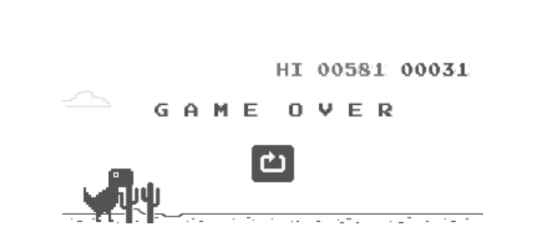

# Dino

  

How could I only get **581** on my e-ink device, even though it runs at **21 FPS**?
So I have to have my own one. Now I can have much higher scores...

The sprites are from [loparcog/chrome-dinosaur](https://github.com/loparcog/chrome-dinosaur) and soundtracks (sound effects) are from [The sounds resource](https://www.sounds-resource.com/browser_games/googlechromedinosaurgame/sound/18002/).

## Demo

[demo](./assets/demo.mp4)

<video width="800" height="600" controls>
  <source src="./assets/demo.mp4" type="video/mp4">
</video>

## TODOs

- [ ] Running soundtrack 🏃‍♂️‍➡️
- [ ] Clouds in the air ☁️
- [ ] Better experience 🎲
- [ ] Duck Dino 🦖
